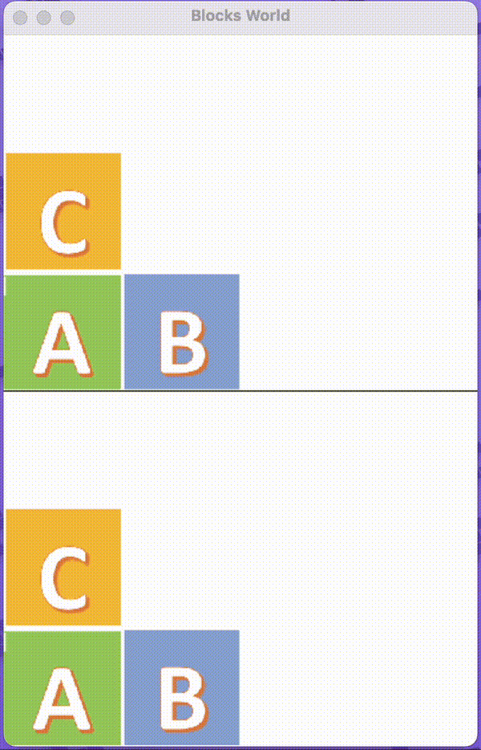

# Blocks World
# Blocks World Problem with Prolog Integration

  

## Overview

The **Blocks World** problem is a classical problem in Artificial Intelligence (AI) and Reinforcement Learning (RL). It involves a set of blocks, typically named with capital letters (such as A, B, C, etc.), which are placed either on top of each other or on a table. The goal is to move these blocks in such a way that a specific target configuration is reached.

In this implementation, we have **three blocks**: **A**, **B**, and **C**, and **four positions** available for them. The agent's task is to rearrange the blocks according to a specified target state, starting from a predefined initial configuration.

## Problem Setup

- **Blocks**: A, B, C
- **Positions**: Four positions (one table and three positions for stacking blocks)
- **Initial State**: The blocks start in a specific arrangement. For example:
  - **Block A** is in position 1 (on the table)
  - **Block B** is in position 2 (on the table)
  - **Block C** is placed on top of **Block A** (in position 1)

The environment for this problem is set up using **Gymnasium**, a toolkit for developing and comparing RL algorithms. I will provide instructions later on how to set up the environment for running this simulation.

The **target configuration** represents the desired final state of the blocks, which the agent needs to achieve by taking a sequence of actions.

## Prolog Integration

To manage the environment and validate the agent’s actions, **Prolog** is integrated in the following way:

1. **Generating All Possible States**: 
   - Prolog creates a set of all possible states for the given problem. This set contains all the configurations that can result from various arrangements of the blocks on the table or on top of each other. 
   - For this specific setup with **three blocks** and **four positions**, there are **14,400 unique states**.

2. **Generating All Possible Actions**: 
   - Prolog generates a set of all possible actions that the agent can take to transition from one state to another. These actions are based on the current configuration and the rules of movement. See the **blocks_world.pl**.
   - Some actions might be **invalid** depending on the current state (e.g., trying to move a block that is already on the table). Prolog checks whether each action is valid based on the state the agent is in.

## Q-table and Action Validation

Once the states and actions are generated by Prolog, a **Q-table** is created. The Q-table serves as a lookup table that stores the expected reward for each state-action pair. This helps the agent decide which action to take at each state.

- When the agent selects an action, **Prolog checks the validity** of that action in the current state.
  - If the action is **valid**, the agent can proceed with it.
  - If the action is **invalid**, the agent will have to choose another action.

By incorporating Prolog into this process, we ensure that the agent’s actions are always valid and that it operates within the constraints of the environment. This helps in speeding up the learning process, as the agent avoids invalid actions that would otherwise waste time and resources.

## Learning Process

The agent learns the best actions to take through **reinforcement learning**. By interacting with the environment and receiving feedback based on the reward or penalty for each action, the agent gradually improves its decision-making and successfully reaches the target configuration.

